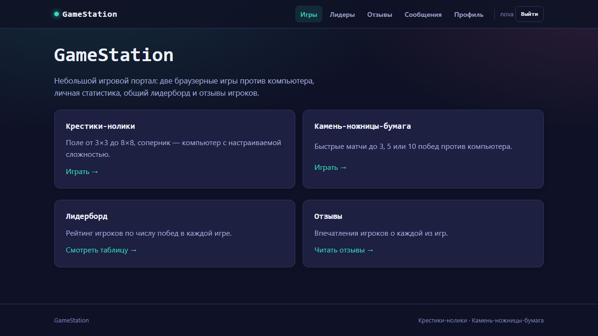
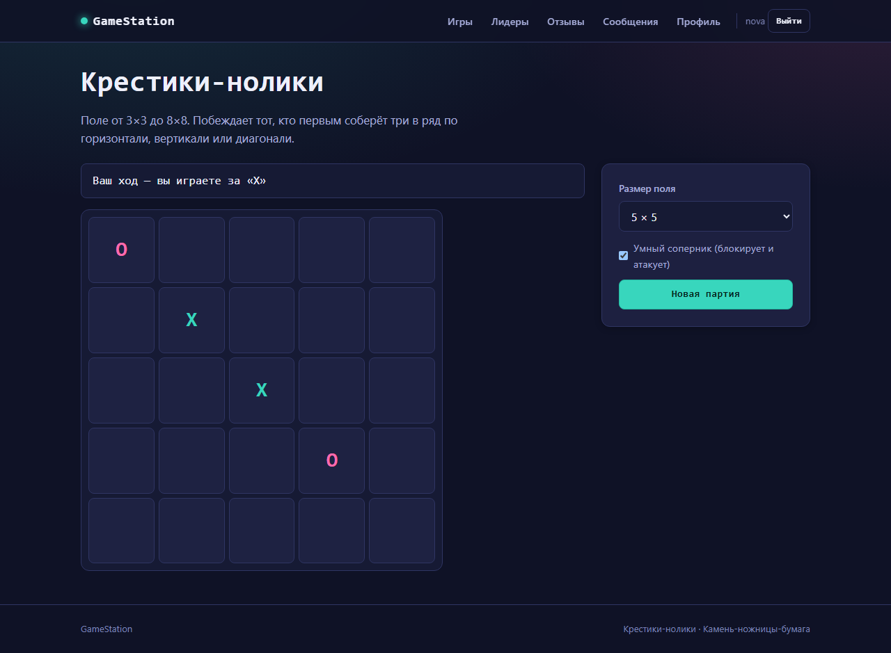
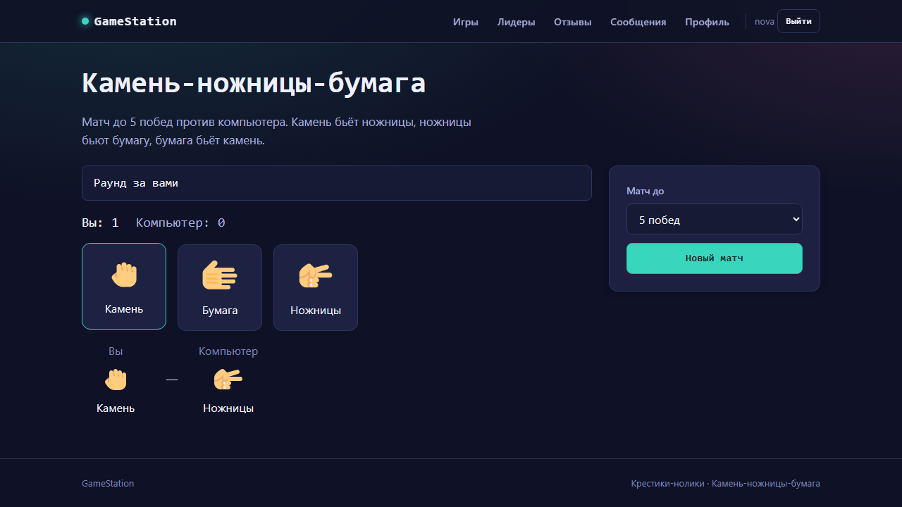
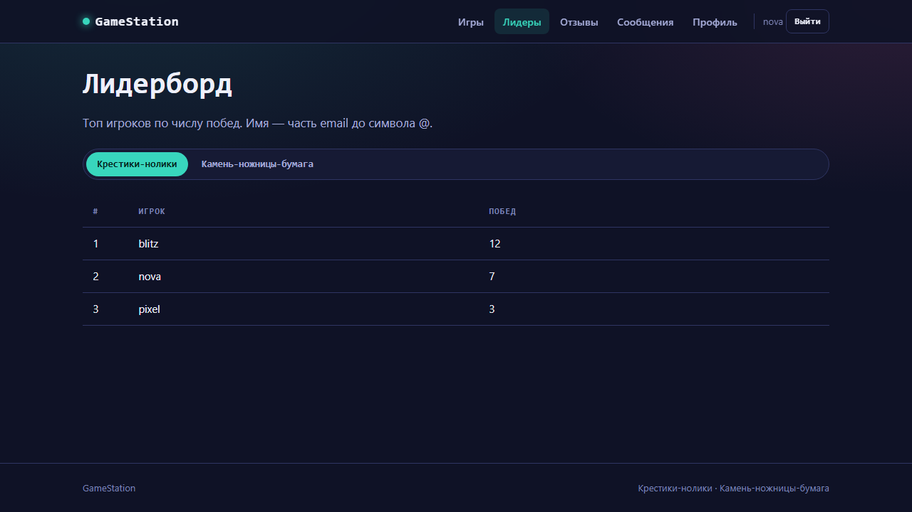
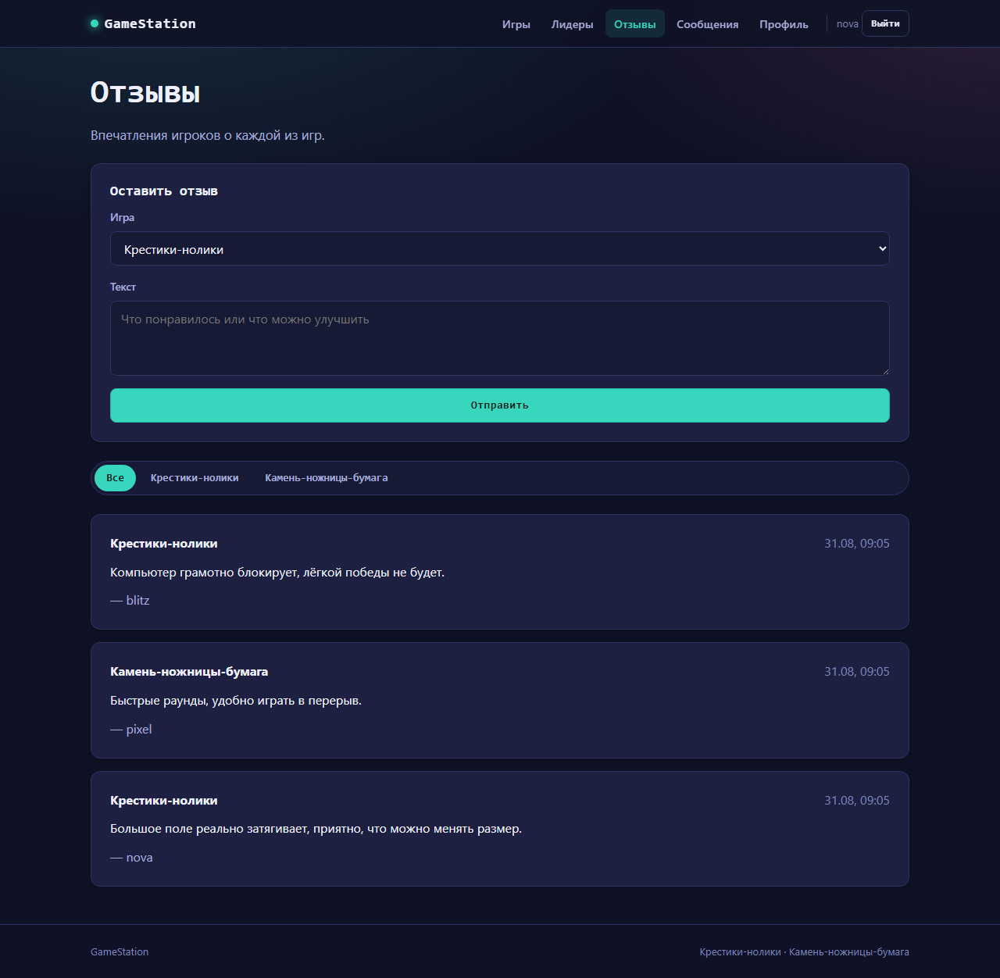
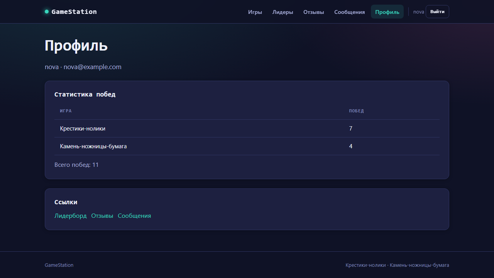
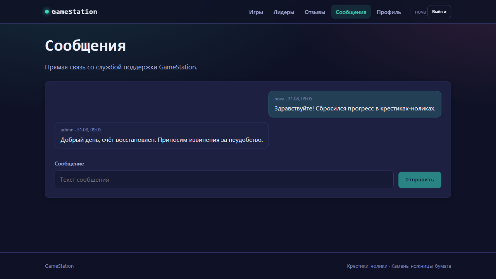
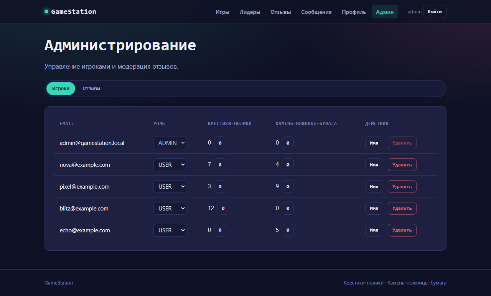

# GameStation

Игровой портал с двумя мини-играми против компьютера, личной статистикой,
лидербордом, отзывами и сообщениями между игроками и администратором.



## Возможности

- регистрация, вход и роли `USER` / `ADMIN`;
- крестики-нолики на поле от 3×3 до 8×8;
- камень-ножницы-бумага до 3, 5 или 10 побед;
- личная статистика и общий лидерборд;
- отзывы с фильтрацией по игре;
- переписка со службой поддержки;
- управление игроками, ролями, счётом и отзывами.

## Интерфейс

| Крестики-нолики | Камень-ножницы-бумага |
| --- | --- |
|  |  |

| Лидерборд | Отзывы |
| --- | --- |
|  |  |

| Профиль | Сообщения |
| --- | --- |
|  |  |



## Стек

- React 18, TypeScript, Vite;
- Express, Prisma, PostgreSQL;
- Zod, TanStack Query, Zustand;
- Vitest, Testing Library, Supertest, Playwright;
- Docker Compose, nginx.

## Структура

```text
apps/api          Express API и Prisma
apps/web          React-интерфейс
apps/e2e          Playwright-сценарии
packages/shared   типы, схемы и игровая логика
```

## Запуск

Требуются Node.js 22, npm 10 и Docker Compose.

```bash
cp .env.example .env
npm ci
npm run docker:up
npm run docker:seed
```

- приложение: http://localhost:8080
- API: http://localhost:4000/api

Остановка и пересоздание локального стека:

```bash
npm run docker:down
npm run docker:reset
```

## Локальная разработка

```bash
cp .env.example .env
npm ci
docker compose up -d db
npm run db:migrate
npm run db:seed
npm run dev
```

- frontend: http://localhost:5173
- API: http://localhost:4000/api

## Конфигурация

Основные переменные перечислены в `.env.example`.

| Переменная | Назначение |
| --- | --- |
| `DATABASE_URL` | подключение API к PostgreSQL |
| `TEST_DATABASE_URL` | отдельная тестовая база |
| `JWT_SECRET` | ключ подписи JWT |
| `JWT_EXPIRES_IN` | срок действия токена |
| `WEB_ORIGIN` | разрешённые origin |
| `SEED_PASSWORD` | пароль демонстрационных аккаунтов |
| `VITE_API_URL` | адрес API для клиента |

## Команды

```bash
npm run lint
npm run typecheck
npm test
npm run build
npm run e2e
npm run db:migrate
npm run db:seed
```
